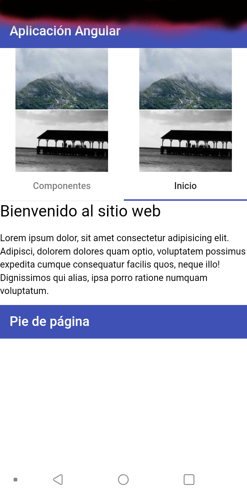

# angular_capacitor
Convertir web Angular a móvil con Capacitor

## Uso del proyecto Angular Material

Usamos el proyecto de Angular material ,ir al proyecto <a href="https://angularmaterialyei.netlify.app/"> Angular Material</a> y se convierte a móvil.

